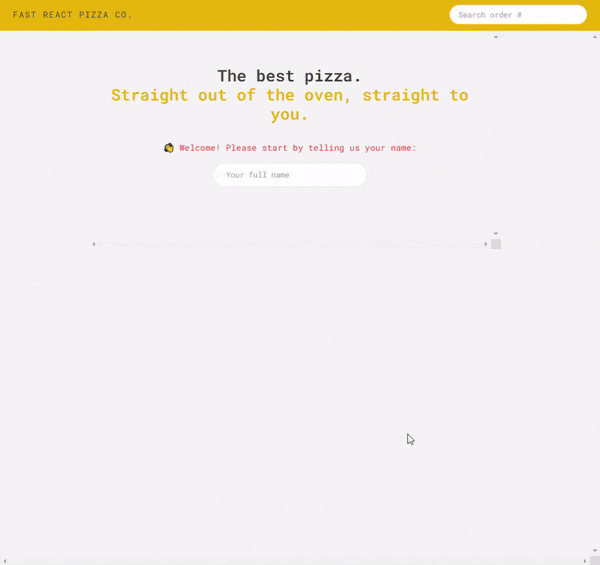
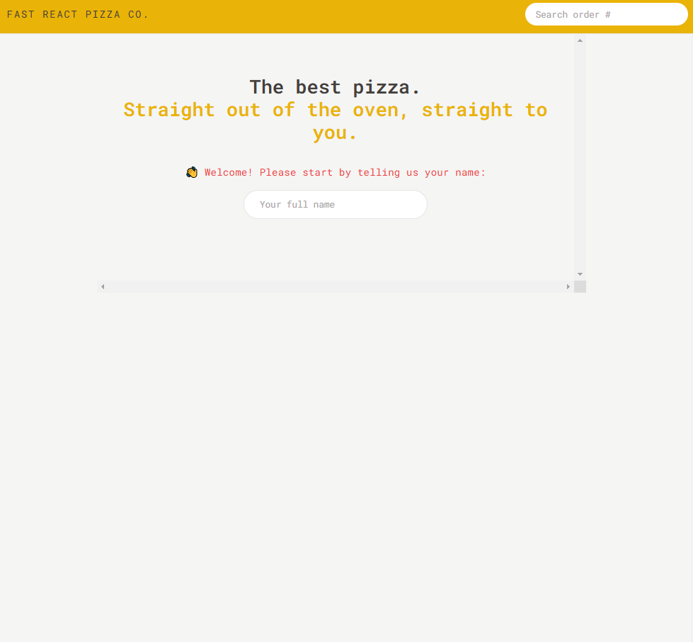
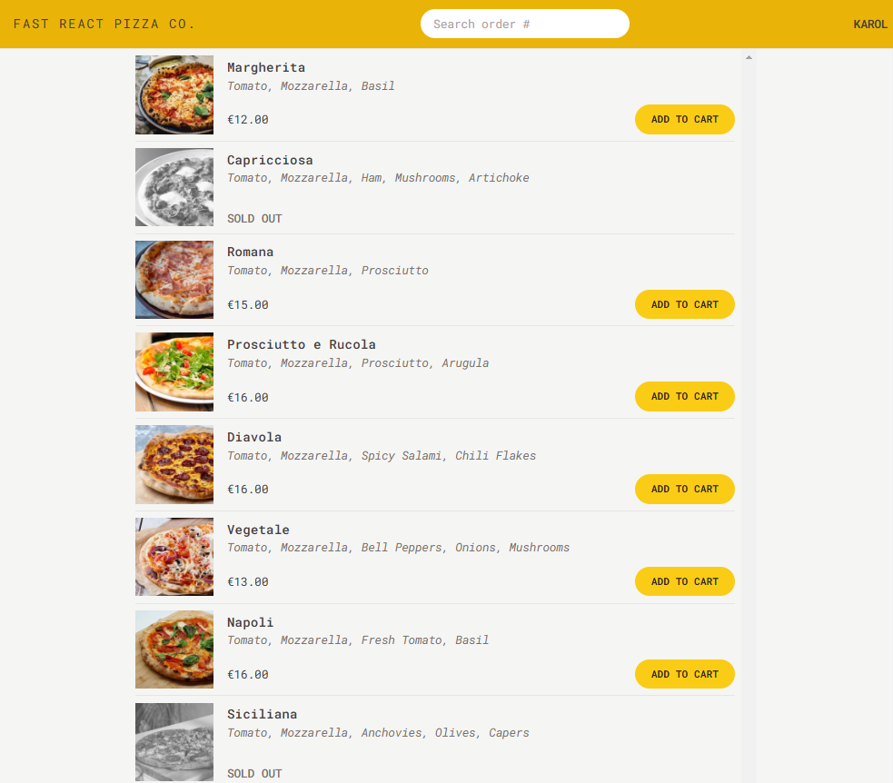
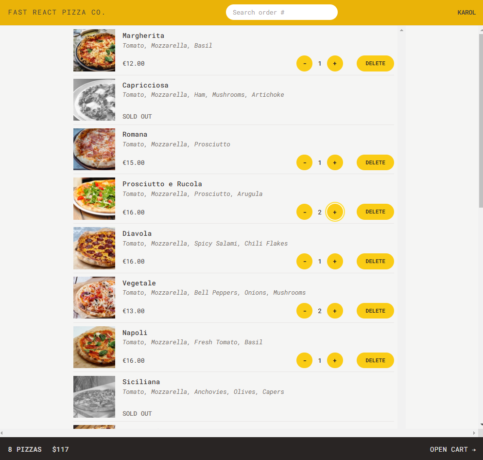
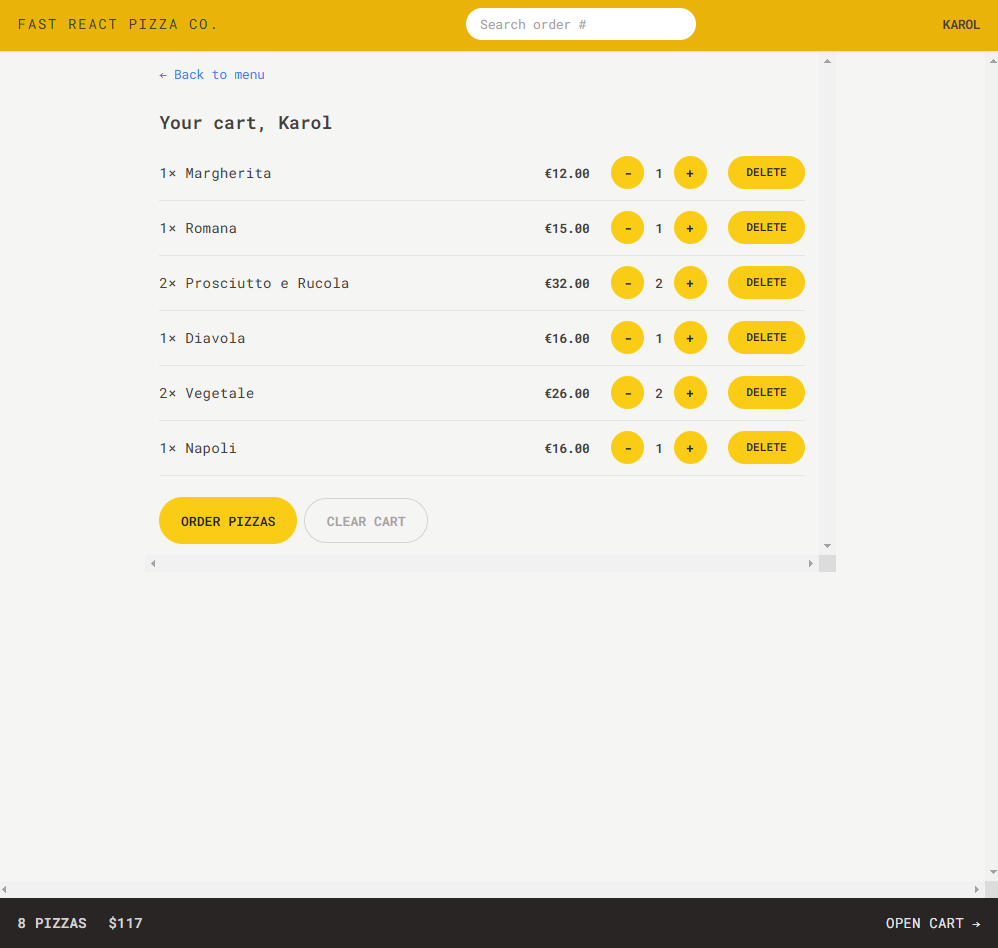
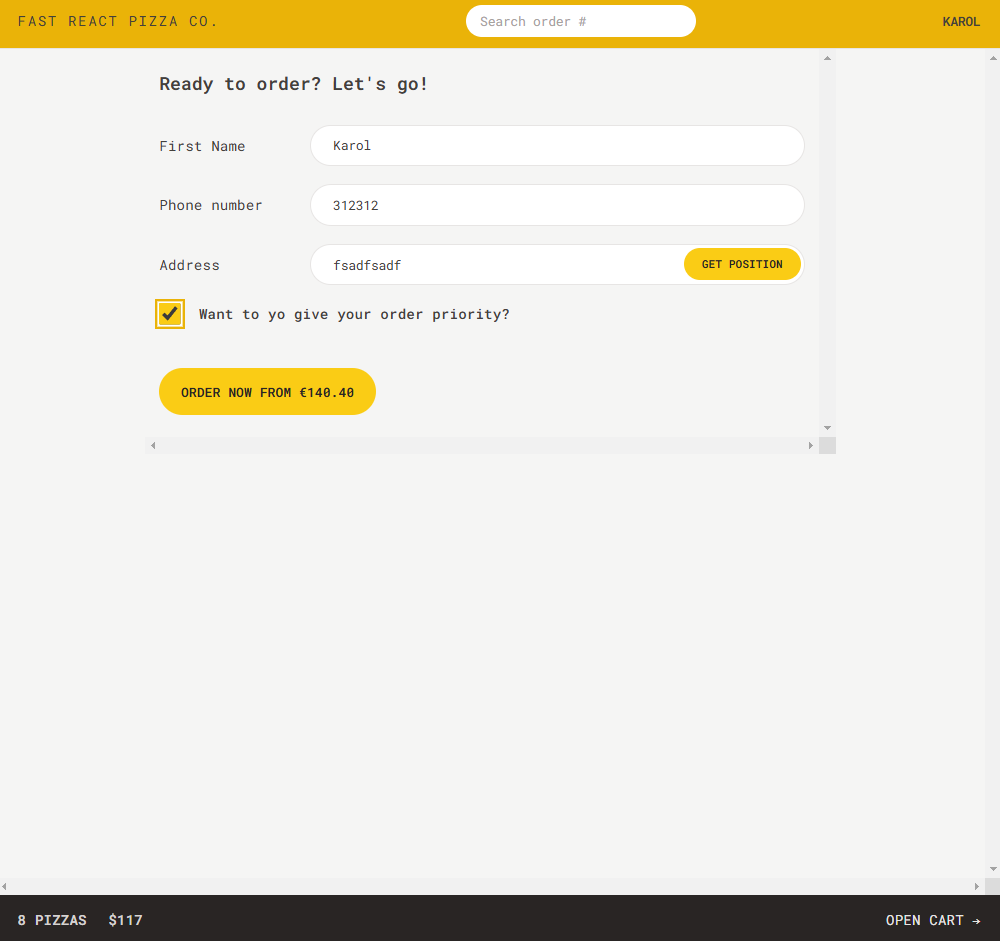
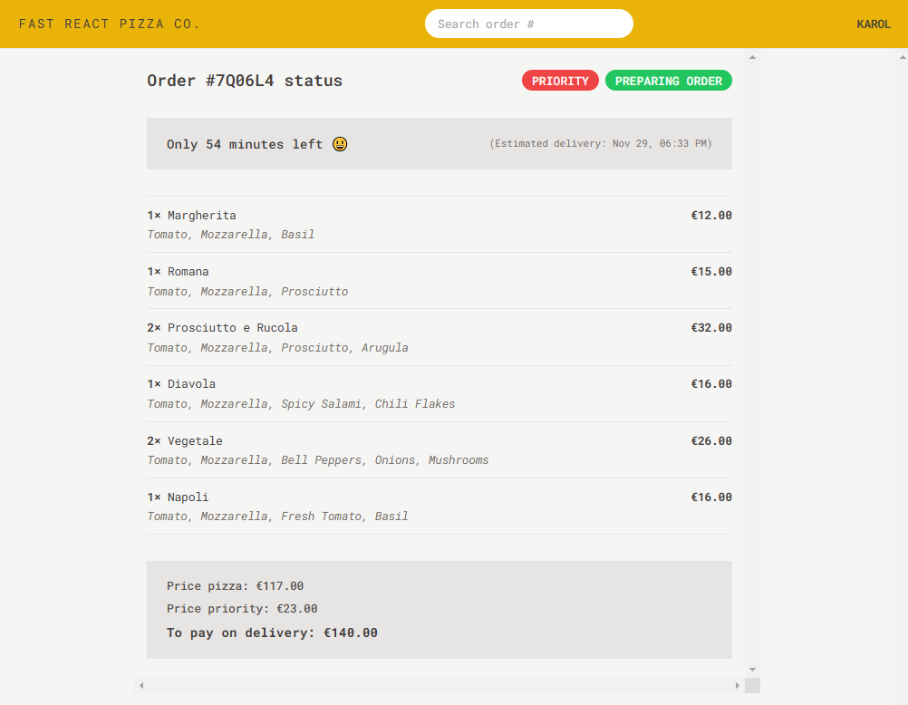

# 🍕 Fast React Pizza 

The **Fast React Pizza Co.** is an interactive pizza ordering application built with React and Redux Toolkit. It offers a seamless experience for browsing menus, managing carts, placing orders, and tracking order status.



---

## 🚀 Features

### **1. Dynamic Pizza Menu**
- Browse a variety of pizzas with detailed descriptions, ingredients, and prices.
- Sold-out pizzas are visually indicated.

### **2. Advanced Cart Management**
- Add, update, or delete items in the cart.
- View the total price and quantity in the cart.
- Clear all items in the cart with one click.

### **3. Seamless Order Placement**
- Submit orders with personalized details:
  - Name, phone number, and address.
- Enable priority delivery with an additional charge.

### **4. Real-Time Order Tracking**
- Track order status and estimated delivery times.
- View itemized order details, including priority fees.

### **5. Search and Retrieve Orders**
- Search for orders using unique order IDs.

### **6. Personalized User Experience**
- Save user details such as name and address for faster order placement.
- Automatically fetch user location for address autofill.

---

## 🛠️ Technologies Used

### **Frontend**
- **React**: For building a dynamic and component-based UI.
- **Redux Toolkit**: For efficient state management.
- **React Router**: For smooth navigation and routing.
  
### **Styling**
- **Tailwind CSS**: For utility-first styling and responsiveness.

### **APIs and Utilities**
- **Geolocation API**: To fetch the user's current location for address input.
- **Intl API**: For formatting currencies and dates.

---

## 📖 How to Run

### **1. Clone the Repository**
```bash
git clone https://github.com/your-username/fast-react-pizza.git
```

### **2. Install Dependencies**
```bash
cd fast-react-pizza-co
npm install
```

### **3. Start the Development Server**
```bash
npm run dev
```
The application will be available at `http://localhost:3000`.

---

## 🧪 Testing the Application

### **Sample User Flow**
1. Browse the pizza menu and add items to the cart.
2. Update quantities or remove items as needed.
3. Proceed to place an order with optional priority delivery.
4. Track the status and estimated delivery time of your order.
5. Search for existing orders by their unique ID.

---

## 🌟 Future Enhancements
- Add user authentication for saved order history.
- Enable multiple payment options.
- Introduce a feature for customer reviews.

---

## 📷 Screenshots  













---

## 📝 License

This project is based on the coursework and tasks provided in the [Jonas Schmedtmann](https://codingheroes.io/) course titled *The Ultimate React Course 2024: React, Next.js, Redux & More*

(available on Udemy). The course materials, including designs, flowcharts, and assets, remain the intellectual property of Jonas Schmedtmann.

The implementation, including all code, solutions, and modifications in this repository, was written independently by me as part of my learning journey. This repository is intended solely for educational and portfolio purposes.

If you are interested in the original course materials or would like to support the instructor, please visit [Jonas Schmedtmann's website](https://codingheroes.io/) or his [Udemy profile](https://www.udemy.com/user/jonasschmedtmann/).

---
